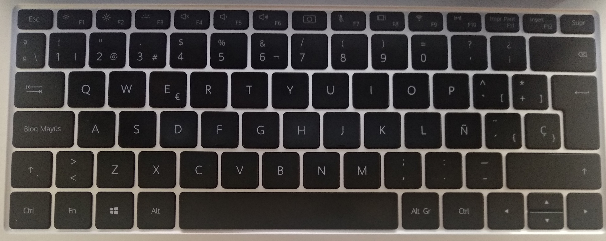

Julio 2020 Ciudad de Mexico
# Distribución de teclado para distribuciones debian
## Introducción
Decidi crear esta configuración de teclado ya que las configuraciones que vienen precargadas en Debian no se adaptan del todo a las etiquetas en el teclado de mi computadora, espero a alguien le sea util como a mi.
Laptop en la que fue probado: Huawei d14 2020

## Intalación
Descargar el repositorio y colocarse en la carpeta raiz del proyecto
Ejecutar los siguientes comandos para colocar la configuración en el sistema

    sudo cp evdev.xml /usr/share/X11/xkb/rules/

    sudo cp latam /usr/share/X11/xkb/symbols

Refrescar el diccionario latam con el comando

    setxkbmap latam

Por ultimo solo debemos acceder a la configuración de hardware de nuestro SO y seleccionar la version Spanish(Latin American,Laptop variant)
Y eso seria todo para tener la configuración.

Distribución virtual completa del teclado

Distribución fisica del teclado

## Agradecimientos y fuentes:

- Documentación - http://people.uleth.ca/~daniel.odonnell/Blog/custom-keyboard-in-linuxx11
- Listado de caracteres especiales en linux - https://gitlab.com/cunidev/gestures/-/wikis/xdotool-list-of-key-codes

- Keyboard Layout como variante de un teclado - https://tuomassalmi.com/tech/custom-keyboard-variant/321

